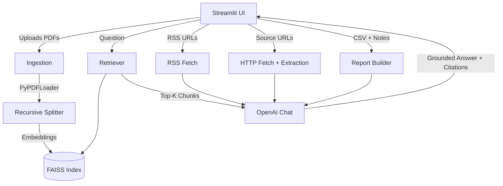

# Data & Research AI Agents (Streamlit)

This Streamlit app bundles four practical AI agents:
- Document Analyzer: Upload PDFs, build a local FAISS index (OpenAI embeddings), and ask questions with citations.
- News Summarizer: Aggregate RSS feeds and generate a concise daily brief.
- Market Researcher: Fetch provided URLs and synthesize a competitor brief.
- Report Generator: Combine CSV tables and analyst notes into a structured report.

## Features
- Local FAISS vector store for your PDFs
- OpenAI `text-embedding-3-small` for embeddings
- GPT-4o family for grounded answers and summaries
- Clean UI with four tabs: Analyzer, News, Market, Report

## Prerequisites
- OpenAI API key
- Windows with Python 3.11+

If you don't have Python:
```powershell
winget install -e --id Python.Python.3.11 --source winget --silent --accept-package-agreements --accept-source-agreements
```
If `pip` isn't found after installation, use the launcher and ensurepip:
```powershell
py -3.11 -m ensurepip --upgrade
py -3.11 -m pip install --upgrade pip
```

## Setup

1) Clone or download this folder, then install dependencies:
```powershell
py -3.11 -m pip install -r E:\Chatbot\requirements.txt
```

2) Provide your OpenAI API key (choose one):
- Environment variable for current PowerShell session:
```powershell
$env:OPENAI_API_KEY = "sk-..."
```
- Or Streamlit secrets file at `E:\Chatbot\.streamlit\secrets.toml`:
```toml
OPENAI_API_KEY = "sk-..."
```

## Run
```powershell
py -3.11 -m streamlit run E:\Chatbot\app.py
```
Then open http://localhost:8501

## Using the App

### Document Analyzer
- Upload one or more PDFs.
- Click "Ingest Documents" to build/update the FAISS index stored at `E:/Chatbot/storage/faiss_index`.
- Ask a question; answers include cited passages.

### News Summarizer
- Edit/paste RSS feed URLs (one per line).
- Click "Summarize News" to generate a concise daily brief.

### Market Researcher
- Enter competitor names and paste relevant source URLs (pricing, docs, blogs, press, etc.).
- Click "Generate Brief" to synthesize positioning, products, strengths/weaknesses, and notable updates with inline URLs.

### Report Generator
- Optionally upload CSV files for quick previews.
- Add objectives and analyst notes, then "Generate Report". Produces a business-style report with sections and bullets.

## Project Structure
```
E:/Chatbot
├─ app.py                   # Streamlit UI with tabs
├─ requirements.txt
├─ agents/
│  ├─ __init__.py
│  ├─ news.py               # RSS fetch + LLM summarization
│  ├─ market.py             # URL fetching + competitor synthesis
│  └─ report.py             # CSV preview + report generation
├─ rag/
│  ├─ __init__.py
│  ├─ ingest.py             # PDF loading, chunking, indexing
│  └─ rag.py                # Retrieval + QA
└─ storage/
   └─ faiss_index/          # On-disk FAISS index
```

## Architecture



## Configuration
- Model dropdown in sidebar (default `gpt-4o-mini`)
- Temperature slider (default 0.2)
- Top-K chunks for retrieval (default 4)
- Index path: `E:/Chatbot/storage/faiss_index`

## Troubleshooting
- "No module named streamlit":
  - You likely installed packages with a different Python. Install with the same interpreter you run:
    ```powershell
    py -3.11 -m pip install -r E:\Chatbot\requirements.txt
    py -3.11 -m streamlit run E:\Chatbot\app.py
    ```
- "pip is not recognized":
  - Use the launcher: `py -3.11 -m pip ...` (as shown above).
- SSL or fetch errors in News/Market tabs:
  - Some sites block scraping; try different sources or fewer URLs.
- FAISS load errors after manual file changes:
  - Delete the folder `E:/Chatbot/storage/faiss_index` and re-ingest.

## Deployment (Streamlit Community Cloud)
1) Push this folder to a GitHub repo.
2) Create a new Streamlit app, point to `app.py`.
3) Add secret `OPENAI_API_KEY` in Streamlit settings.
4) Deploy. The app should load the four tabs automatically.

## License
MIT
